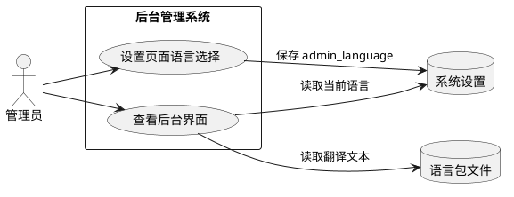
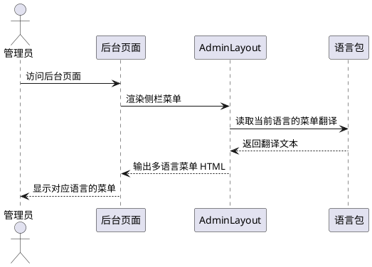
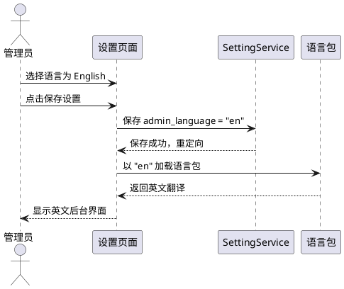
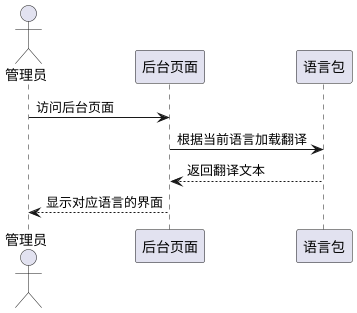

# **1. 组件定位**

## **1.1 核心职责**

本组件负责后台管理界面的国际化（i18n）支持，将硬编码的中文文本替换为语言包调用，并在后台设置页面提供语言切换下拉选择功能。

## **1.2 核心输入**

1. 管理员在后台设置页面选择界面语言（简体中文/繁体中文/英文）
2. 后台页面渲染时对语言包键的调用请求
3. 当前语言设置值（从系统设置 `admin_language` 读取）

## **1.3 核心输出**

1. 根据当前语言设置渲染对应语言的后台界面文本
2. 后台设置页面"基本"分组中的语言下拉选择控件
3. HTML `lang` 属性根据当前语言动态输出

## **1.4 职责边界**

- 本组件**不负责**前台主题模板的国际化（前台由主题自行处理）
- 本组件**不负责**安装向导的国际化（安装向导已有独立的 i18n 机制）
- 本组件**不负责** API 层的国际化（API 返回固定格式，不含 UI 文本）
- 本组件**不负责**新增语言包的翻译内容质量保证（仅提供机制框架）

# **2. 领域术语**

**语言包**
: 以 PHP 关联数组形式存储的翻译映射文件，键为英文点分标识符，值为对应语言的翻译文本。

**语言键（lang key）**
: 语言包中用于唯一标识一条翻译文本的点分格式字符串，如 `admin.menu.dashboard`。

**当前语言（current locale）**
: 系统设置 `admin_language` 中存储的当前后台界面语言标识符，取值为 `zh-cn`、`zh-tw`、`en` 之一。

**i18n**
: Internationalization 的缩写，指软件支持多语言的国际化机制。

# **3. 角色与边界**

## **3.1 核心角色**

- **管理员**：通过后台设置页面切换后台界面语言，查看不同语言的后台界面。

## **3.2 外部系统**

- **系统设置服务（SettingService）**：存储和读取 `admin_language` 配置项。
- **语言包文件（Languages 目录）**：提供各语言的翻译文本数据。

## **3.3 交互上下文**

# **4. DFX约束**

## **4.1 性能**

- 语言包加载必须在单次请求内完成，禁止额外的数据库查询
- 语言包文件应使用 PHP 原生 return 数组格式，利用 OPcache 加速

## **4.2 可靠性**

- 当语言键在当前语言包中不存在时，必须回退到简体中文（zh-cn）语言包
- 当语言键在所有语言包中均不存在时，必须直接输出语言键本身作为兜底

## **4.3 安全性**

- 语言包翻译文本在输出到 HTML 时必须经过转义处理，防止 XSS

## **4.4 可维护性**

- 语言键命名必须遵循统一的层级命名规范：`模块.子模块.条目`
- 新增语言只需在 `system/Languages/` 目录下添加对应的 PHP 文件

## **4.5 兼容性**

- 语言切换后，已保存的系统设置数据不受影响
- `admin_language` 设置项的默认值为 `zh-cn`，与现有行为保持一致

# **5. 核心能力**

## **5.1 后台菜单国际化**

### **5.1.1 业务规则**

1. **菜单标签语言包化**：后台侧栏菜单的所有标签文本必须从语言包读取，禁止硬编码中文。

   a. 验收条件：[访问后台任意页面] → [侧栏菜单标签文本根据当前语言设置显示对应语言]

2. **菜单语言键命名规范**：菜单项的语言键必须使用 `admin.menu.{key}` 格式。

   a. 验收条件：[查看语言包文件] → [菜单相关键均以 `admin.menu.` 开头]

3. **顶栏文本语言包化**：后台顶栏中的"欢迎，"、"设置"、"前台"、"退出登录"等文本必须从语言包读取。

   a. 验收条件：[访问后台任意页面] → [顶栏文本根据当前语言设置显示对应语言]

### **5.1.2 交互流程**

### **5.1.3 异常场景**

1. **语言包文件缺失**

   a. 触发条件：当前语言对应的语言包文件不存在

   b. 系统行为：回退到 zh-cn 语言包

   c. 用户感知：界面以简体中文显示

2. **语言键缺失**

   a. 触发条件：某个语言键在当前语言包中不存在

   b. 系统行为：回退到 zh-cn 语言包中对应键的值；若仍不存在，输出语言键本身

   c. 用户感知：界面显示简体中文对应文本或语言键标识

## **5.2 后台设置页面语言选择**

### **5.2.1 业务规则**

1. **语言选择控件**：后台设置页面"基本"分组中的 `admin_language` 字段必须渲染为下拉选择框（select），而非普通文本输入框。

   a. 验收条件：[访问后台设置 → 基本分组] → [后台语言字段显示为下拉选择框，包含简体中文、繁体中文、英文三个选项]

2. **可选语言列表**：下拉选择框必须提供以下三个固定选项：

   - `zh-cn` → 简体中文
   - `zh-tw` → 繁体中文
   - `en` → English

   a. 验收条件：[点击后台语言下拉框] → [显示上述三个选项，值和标签正确对应]

3. **语言即时生效**：保存语言设置后，页面刷新即以新语言显示后台界面。

   a. 验收条件：[将语言从简体中文切换为 English → 保存设置] → [页面刷新后，后台菜单和界面文本以英文显示]

4. **默认语言**：`admin_language` 的默认值必须为 `zh-cn`。

   a. 验收条件：[全新安装后访问后台] → [后台界面以简体中文显示]

5. **HTML lang 属性**：后台页面的 `<html lang="...">` 属性必须根据当前 `admin_language` 设置动态输出。

   a. 验收条件：[将后台语言切换为 English] → [HTML lang 属性变为 `en`]

### **5.2.2 交互流程**

### **5.2.3 异常场景**

1. **无效语言值**

   a. 触发条件：`admin_language` 被设置为不在支持列表中的值

   b. 系统行为：回退到 `zh-cn`

   c. 用户感知：界面以简体中文显示

## **5.3 后台各页面文本国际化**

### **5.3.1 业务规则**

1. **页面标题国际化**：所有后台页面的标题（如"系统设置"、"文章管理"、"用户管理"等）必须从语言包读取。

   a. 验收条件：[切换语言为 English → 访问文章管理页面] → [页面标题显示 "Posts" 而非 "文章管理"]

2. **表单标签国际化**：所有后台表单的字段标签、占位符、帮助文本必须从语言包读取。

   a. 验收条件：[切换语言为 English → 访问系统设置页面] → [所有字段标签显示英文]

3. **按钮文本国际化**：所有后台按钮文本（如"保存设置"、"新建文章"等）必须从语言包读取。

   a. 验收条件：[切换语言为 English → 访问任意后台页面] → [按钮文本显示英文]

4. **提示消息国际化**：所有后台提示消息（如"设置已保存"、"保存成功"等）必须从语言包读取。

   a. 验收条件：[切换语言为 English → 保存设置] → [成功提示显示英文]

5. **错误消息国际化**：所有后台错误消息必须从语言包读取。

   a. 验收条件：[切换语言为 English → 提交无效表单] → [错误消息显示英文]

6. **登录页面国际化**：登录页面的所有文本必须从语言包读取。

   a. 验收条件：[切换语言为 English → 访问登录页面] → [登录页面所有文本显示英文]

### **5.3.2 交互流程**

### **5.3.3 异常场景**

1. **翻译文本缺失**

   a. 触发条件：某个文本在当前语言包中没有对应翻译

   b. 系统行为：回退到 zh-cn 对应键值；若仍不存在，输出语言键本身

   c. 用户感知：显示简体中文文本或语言键标识

# **6. 数据约束**

## **6.1 语言包条目**

1. **键（key）**：点分格式英文标识符，必须以模块前缀开头（如 `admin.menu.dashboard`），不可为空
2. **值（value）**：对应语言的翻译文本字符串，不可为空
3. **覆盖范围**：必须覆盖后台所有 Admin 控制器中出现的硬编码中文文本

## **6.2 admin_language 设置项**

1. **值域**：仅允许 `zh-cn`、`zh-tw`、`en` 三个值
2. **默认值**：`zh-cn`
3. **存储位置**：系统设置表（system_settings）中的 `admin_language` 键
